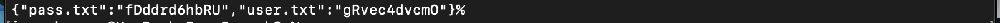

### **K8 secrets**

Create secrets:

```
kubectl get secrets
```


Verifying secrets:

```
kubectl describe secrets/app-credentials
```


Decoding secret:

```
kubectl describe secrets/app-credentials -o jsonpath='{.data}'
```

#

```
echo fDddrd6hbRU | base64 -d
```

#

Pods:

```
kubectl get po
```


Env:

```
kubectl exec flask-app-4G37sK394P-cs35k -- printenv | grep admin
```


