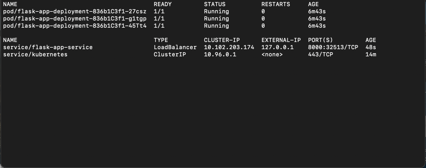
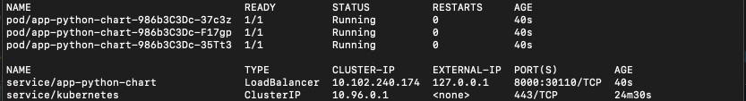
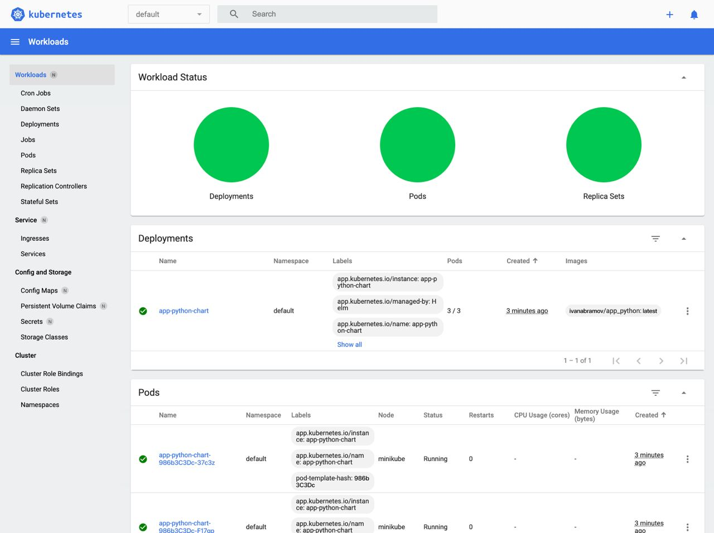

### **Kubernetes**

Output with config files:
```
kubectl get pods,svc
```



### **Helm**

Pods & Services:



Dashboard charts:



### **Bonus task**

**Ingress** - is a special service which describes routing in kubernetes cluster either using HTTP or HTTPS

**Ingress controller** - is implementation of ingress (Aka load balancer)

**StatefulSet** - is a bunch of pods with unique identifiers. It is useful if you want to manage stateful apps.

**DaemonSet** - feature which guarantees that all or some nodes run exact copies of pod.

**Persistent volumes** - is a resource independent of pods which use it.

**Library charts** - is a special type of charts which describes reusable components. So, that they can be used in other templates easily.