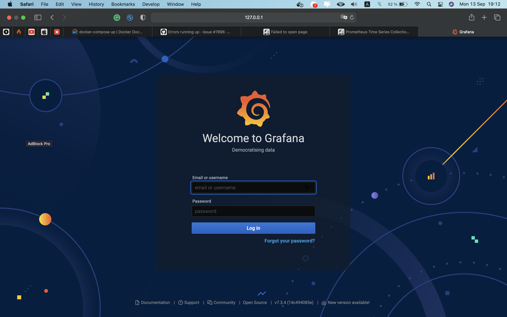
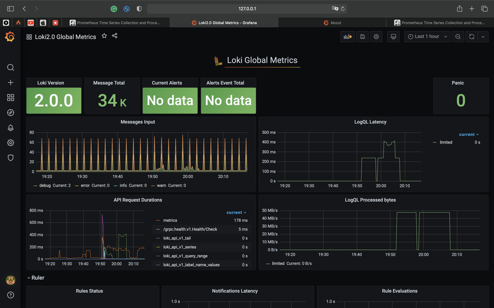
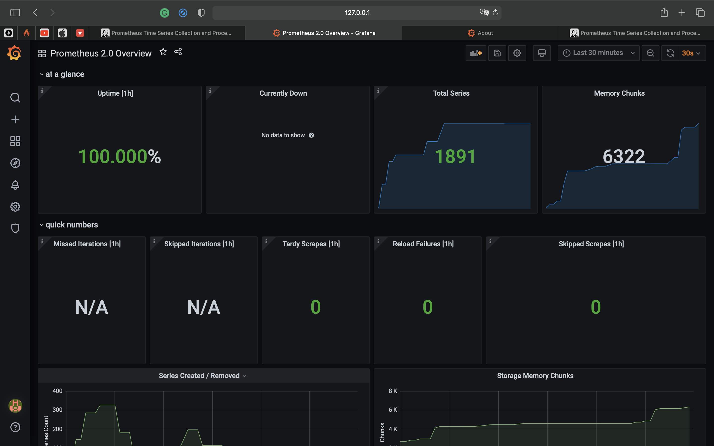
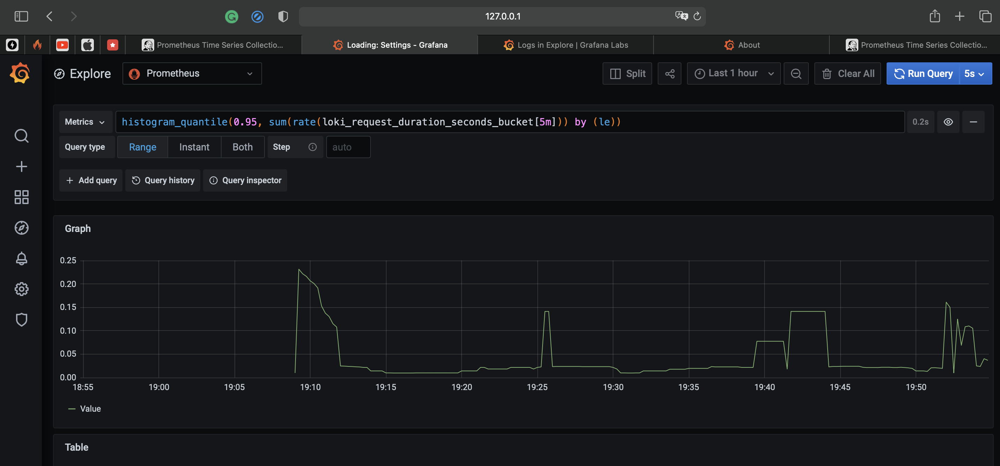
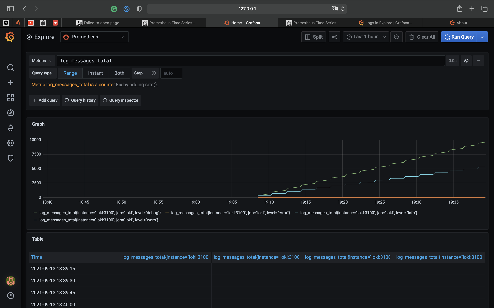
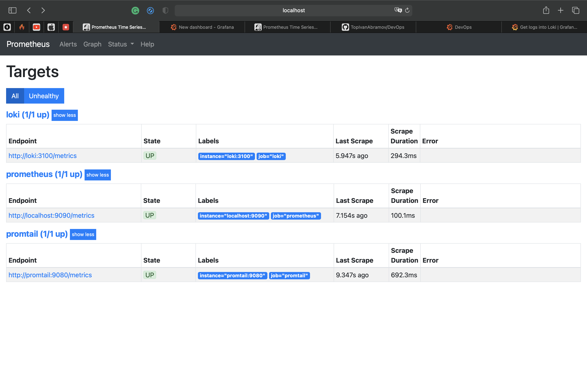
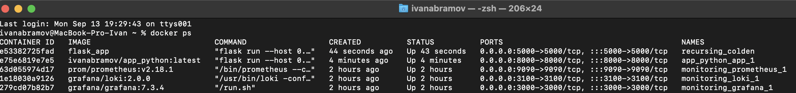
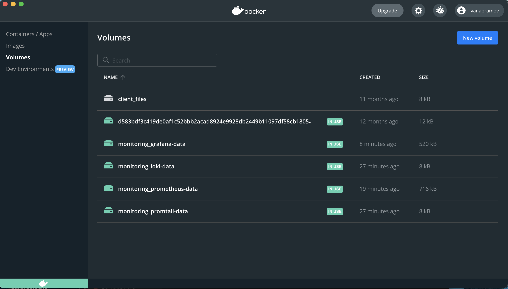

### **Logging best practices**

- Use prod-ready logging framework
- Do not lock main thread with logging
- Set up dashboard to monitor logs
- Use appropriate log categories and log messages
- Save logs to storage
- Do log rotation
- Do not put sensitive data in logs

Grafana:

Dashboards:

Stats:

Running images:

Volumes:

